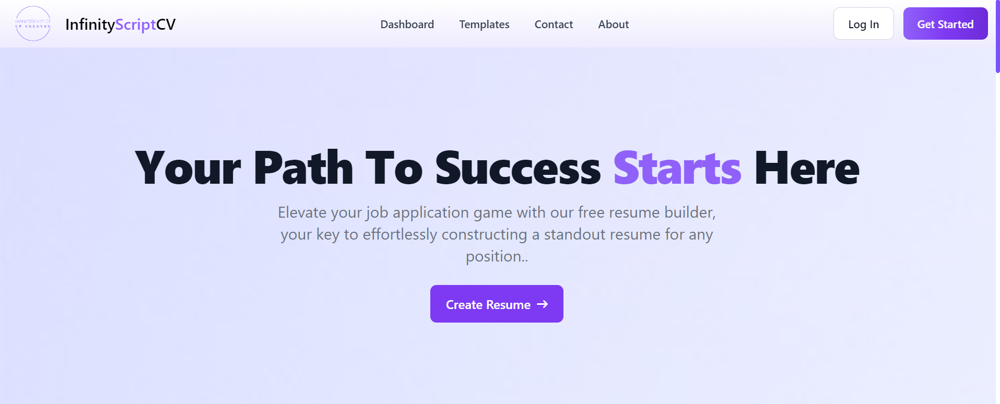
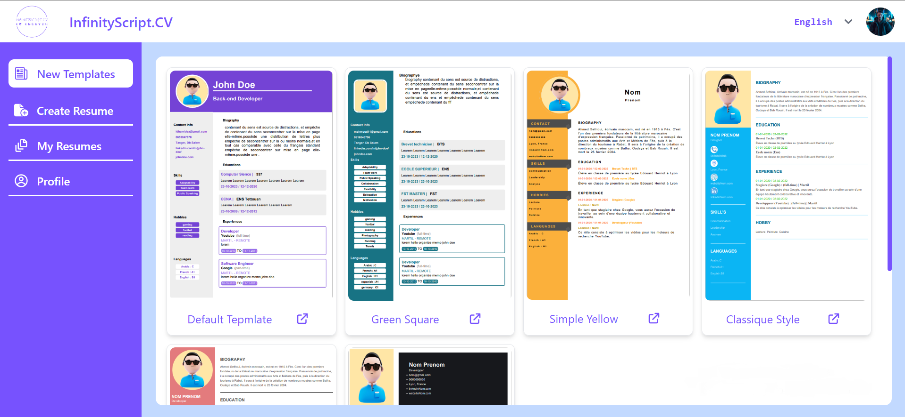
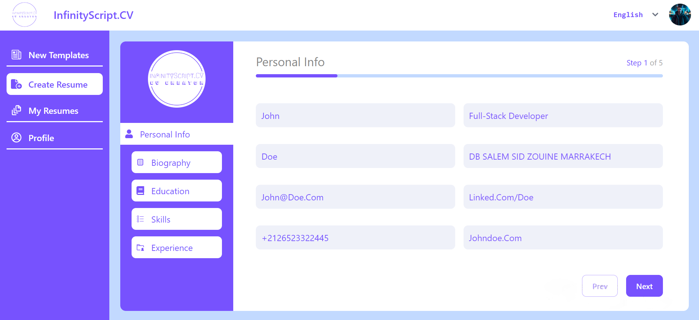

# InfinityScript.CV (Laravel/ReactJS)
InfinityScript.CV is a dynamic and feature-rich resume builder built using Laravel API and ReactJS. This project provides a user-friendly interface for users to create and download professional resumes effortlessly.

## Features:

- **Multilingual Support:**
  - Seamlessly switch between *English* and *Arabic* languages for a personalized user experience.

- **Resume Creation:**
  - Easily create and customize detailed resumes with sections for education, experience, skills, and more.

- **PDF Download:**
  - Download polished and professionally styled resumes in PDF format.

For detailed installation instructions, please check the [Installation Guide](./installation-guide.pdf).

## Screenshots

